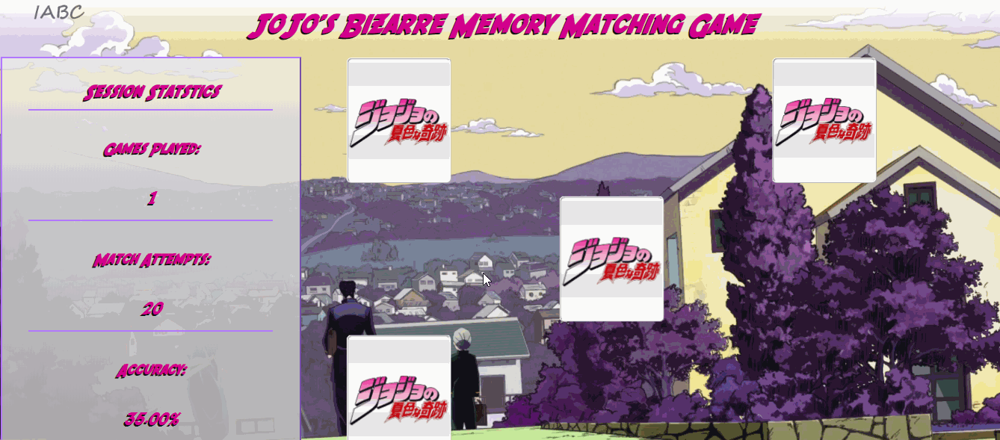
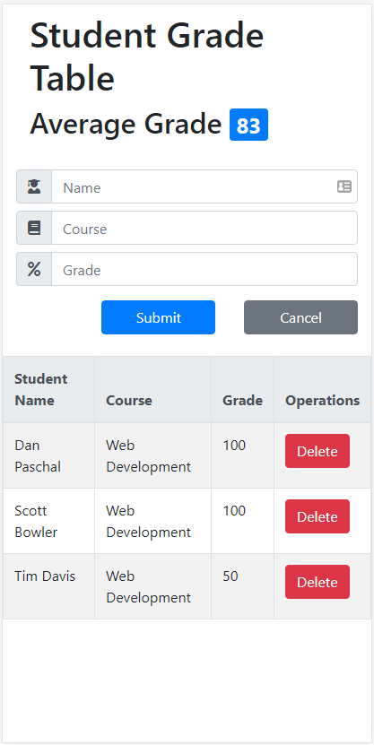

# JoJo's Bizarre Memory Match
A JavaScript based card matching game themed after the anime series, "JoJo's Bizarre Adventure".

## Technologies Utilized
- JavaScript
- jQuery
- HTML5
- CSS3
- AWS EC2

## Live Demo Link
Try out the game at: https://memory.christian-haney.com

## Features
- Players can flip over cards by clicking them with the mouse
- Players can make matches by flipping over a set of two identical cards
- Players can win the game by finding all pairs of matching cards
- Players can start a new game after winning the current game by pressing "Play Again"
- Players can view the number of games played during the current session
- Players can view the number of match attempts made during the current game
- Players can view their accuracy as a percentage of attempted matches that were correct
- Players can change the font of the game between a custom font and the default sans-serif font of their browser

## Previews
#### Starting a Game


#### Ending a Game


#### Mobile View


## Installation
#### System Requirements
- None
#### Getting Started
1. Clone this repository into the desired directory
```
git clone https://github.com/Coding-Christian/memory-match-game
```
2. Navigate to the root of the cloned repository
```
cd memory-match-game
```
3. Open the the file `index.html` in your preferred web browser
```
start /index.html
```
